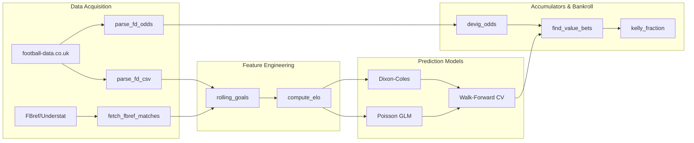

# footbet

European Football Betting Analytics with Sharp Odds.

Download, process, and model European football match data and sharp
bookmaker odds (Pinnacle). Implements Poisson/Dixon-Coles models, Elo
ratings, and Kelly-criterion staking for value betting on full-time and
half-time outcomes.

## Installation

### Standard R

``` r
# install.packages("remotes")
remotes::install_github("johngavin/footbet")
```

### Nix (Recommended)

``` bash
git clone https://github.com/johngavin/footbet.git
cd footbet
./default.sh
```

### rix Integration

``` r
library(rix)
rix(
  r_pkgs = c("dplyr", "arrow", "duckdb"),
  git_pkgs = list(
    list(
      package_name = "footbet",
      repo_url = "https://github.com/johngavin/footbet",
      commit = "HEAD"
    )
  ),
  ide = "none",
  project_path = ".",
  overwrite = TRUE
)
```

## Coverage

10 leagues (top 2 divisions) across 5 countries, 10 years of history:

| Country | Division 1          | Division 2         |
|---------|---------------------|--------------------|
| England | E0 (Premier League) | E1 (Championship)  |
| Germany | D1 (Bundesliga)     | D2 (2. Bundesliga) |
| Italy   | I1 (Serie A)        | I2 (Serie B)       |
| Spain   | SP1 (La Liga)       | SP2 (Segunda)      |
| France  | F1 (Ligue 1)        | F2 (Ligue 2)       |

## Model Pipeline



## Walk-Forward AH Backtest: Null Result

A full walk-forward Asian Handicap backtest against Pinnacle prices
across six seasons and four models (GLM, Ranger, xG-Kalman-Dixon-Coles,
ensemble), with both flat and Kelly staking, did not find a profitable
edge. Best ROI reached -5.4% after Kelly staking, per-league intercepts
and Kalman σ tuning (see issues
[\#59](https://github.com/JohnGavin/footbet/issues/59),
[\#81](https://github.com/JohnGavin/footbet/issues/81),
[\#82](https://github.com/JohnGavin/footbet/issues/82)). The
xG-Kalman-DC stack was the second-best model at -7.3% before tuning.

- **Detailed methodology, results and leaderboard**:
  [`plans/MODEL_CATALOGUE.md`](plans/MODEL_CATALOGUE.md)
- **Session-by-session lab notes and failed approaches**:
  [`CHANGELOG.md`](CHANGELOG.md)
- **Closing Line Value (CLV) diagnostic**: `R/clv.R` —
  `load_closing_ah_prices()`, `attach_clv()`, `summarise_clv()`. See
  `plan_clv.R` for targets `oos_ah_clv_summary`,
  `oos_ah_{ranger,ensemble}_clv_summary`. CLV is the honest follow-up
  test to “no edge vs Pinnacle” — it disambiguates “model found nothing”
  from “model found something only softer books pay”.
- **Kalman innovation logging**:
  `kalman_strengths(..., record_innovations = TRUE)` returns
  standardised innovations `ε_t = (y_t - ŷ_t|t-1) / sqrt(S_t)` for
  regime-break diagnostics (manager changes, transfer shocks).

Publishing a documented null result from a clean walk-forward backtest
is rare in this space; the intent is that other projects attempting the
same stack can calibrate expectations against these results rather than
rediscovering them.

## Positive Finding: xG Features Improve Calibration

While the AH bet family produces no edge, xG rolling features do
reliably improve prediction quality over a goals-only Poisson GLM
baseline in leak-corrected walk-forward CV
([\#84](https://github.com/JohnGavin/footbet/issues/84)):

- **Log-loss**: goals-only 1.07 → xG 1.00 (~6.5% improvement)
- **Brier**: 0.620 → 0.592 (~4.5%)
- **RPS**: 0.211 → 0.202 (~4.3%)

The improvement survives the 7-day bet-time cutoff correction unchanged
(cut0 vs cut7: log_loss 1.00 vs 1.00).

**Per-league breakdown** (log-loss improvement, cut7): EPL +1.6%, Serie
A +1.6%, Bundesliga +1.3%, Ligue 1 +0.9%, La Liga +0.2%. All 5 leagues
show improvement; none regress.

**Model comparison on xG-era data** (top-5 leagues, 2019–2025): GLM
goals-only 1.018, Dixon-Coles 1.017, GLM+xG 1.003. Dixon-Coles barely
beats GLM on goals alone; xG features provide a larger gain than the DC
low-score correction.

**Brier decomposition**: xG improves resolution (0.019 vs 0.019) while
maintaining identical reliability (~0.0006). The gain is in sharpness
(more decisive predictions), not better calibration. The xG advantage is
real but too diffuse to overcome Pinnacle’s AH vig when translated to
per-match bet selection.

## Project Structure

<details>

<summary>

Project structure (click to expand)
</summary>

    .
    ├── CHANGELOG.md
    ├── CLAUDE.md
    ├── DESCRIPTION
    ├── LICENSE
    ├── LICENSE.md
    ├── NAMESPACE
    ├── NIX_SHELL_WORKAROUND.md
    ├── QUICK_START.md
    ├── R
    │   ├── backtest_oagd.R
    │   ├── betting.R
    │   ├── clv.R
    │   ├── data_download.R
    │   ├── data_fbref.R
    │   ├── data_parse.R
    │   ├── data_transfers.R
    │   ├── data_understat.R
    │   ├── data_validation.R
    │   ├── database.R
    │   ├── dev
    │   │   └── issues
    │   ├── devig.R
    │   ├── diagrams.R
    │   ├── features.R
    │   ├── globals.R
    │   ├── kelly.R
    │   ├── leakage_fix.R
    │   ├── model_kalman.R
    │   ├── model_oagd.R
    │   ├── model_predict.R
    │   ├── models_baseline.R
    │   ├── models_brms.R
    │   ├── models_dc.R
    │   ├── models_eval.R
    │   ├── models_xgboost.R
    │   ├── plot_theme.R
    │   ├── setup_nix_libs.R
    │   ├── simulation.R
    │   ├── tar_plans
    │   │   ├── plan_brms_1x2.R
    │   │   ├── plan_clv.R
    │   │   ├── plan_cutoff.R
    │   │   ├── plan_data_acquisition.R
    │   │   ├── plan_data_validation.R
    │   │   ├── plan_decisions.R
    │   │   ├── plan_doc_examples.R
    │   │   ├── plan_evaluation.R
    │   │   ├── plan_features.R
    │   │   ├── plan_models.R
    │   │   ├── plan_models_brms.R
    │   │   ├── plan_oagd.R
    │   │   ├── plan_oos.R
    │   │   ├── plan_pkgctx.R
    │   │   ├── plan_pkgdown.R
    │   │   ├── plan_qa_gates.R
    │   │   ├── plan_quality_control.R
    │   │   ├── plan_ranger_1x2.R
    │   │   ├── plan_transfers.R
    │   │   ├── plan_vignette_outputs.R
    │   │   ├── plan_xg_features.R
    │   │   ├── plan_xgboost_1x2.R
    │   │   └── plan_xgk.R
    │   └── utils.R
    ├── README.md
    ├── README.qmd
    ├── README.rmarkdown
    ├── _pkgdown.yml
    ├── default.R
    ├── default.nix
    ├── default.sh
    ├── docs
    │   ├── 404.html
    │   ├── 404.md
    │   ├── CHANGELOG.html
    │   ├── CHANGELOG.md
    │   ├── CLAUDE.html
    │   ├── CLAUDE.md
    │   ├── LICENSE-text.html
    │   ├── LICENSE-text.md
    │   ├── LICENSE.html
    │   ├── LICENSE.md
    │   ├── NIX_SHELL_WORKAROUND.html
    │   ├── NIX_SHELL_WORKAROUND.md
    │   ├── QUICK_START.html
    │   ├── QUICK_START.md
    │   ├── articles
    │   │   ├── ah-backtest.html
    │   │   ├── ah-backtest.md
    │   │   ├── ah-backtest_files
    │   │   ├── data-cleaning.html
    │   │   ├── data-cleaning.md
    │   │   ├── data-cleaning_files
    │   │   ├── data-sources.html
    │   │   ├── data-sources.md
    │   │   ├── data-sources_files
    │   │   ├── eda.html
    │   │   ├── eda.md
    │   │   ├── eda_files
    │   │   ├── football-analytics.html
    │   │   ├── football-analytics.md
    │   │   ├── football-analytics_files
    │   │   ├── glossary.html
    │   │   ├── glossary.md
    │   │   ├── glossary_files
    │   │   ├── index.html
    │   │   ├── index.md
    │   │   ├── models-betting.html
    │   │   └── models-betting_files
    │   ├── authors.html
    │   ├── authors.md
    │   ├── deps
    │   │   ├── bootstrap-5.3.1
    │   │   ├── bootstrap-toc-1.0.1
    │   │   ├── clipboard.js-2.0.11
    │   │   ├── data-deps.txt
    │   │   ├── font-awesome-6.5.2
    │   │   ├── headroom-0.11.0
    │   │   ├── jquery-3.6.0
    │   │   └── search-1.0.0
    │   ├── extra.css
    │   ├── extra.js
    │   ├── index.html
    │   ├── index.md
    │   ├── katex-auto.js
    │   ├── lightswitch.js
    │   ├── link.svg
    │   ├── llms.txt
    │   ├── pkgdown.js
    │   ├── pkgdown.yml
    │   ├── reference
    │   │   ├── COUNTRY_COLORS.html
    │   │   ├── COUNTRY_COLORS.md
    │   │   ├── TIER_COLORS.html
    │   │   ├── TIER_COLORS.md
    │   │   ├── acca_ev.html
    │   │   ├── acca_ev.md
    │   │   ├── acca_odds.html
    │   │   ├── acca_odds.md
    │   │   ├── accumulator_probability.html
    │   │   ├── accumulator_probability.md
    │   │   ├── add_form_scores.html
    │   │   ├── add_form_scores.md
    │   │   ├── add_form_streaks.html
    │   │   ├── add_form_streaks.md
    │   │   ├── add_h2h_features.html
    │   │   ├── add_h2h_features.md
    │   │   ├── add_league_metadata.html
    │   │   ├── add_league_metadata.md
    │   │   ├── add_league_positions.html
    │   │   ├── add_league_positions.md
    │   │   ├── add_matches_since.html
    │   │   ├── add_matches_since.md
    │   │   ├── add_player_availability.html
    │   │   ├── add_player_availability.md
    │   │   ├── add_ratio_features.html
    │   │   ├── add_ratio_features.md
    │   │   ├── add_rest_days.html
    │   │   ├── add_rest_days.md
    │   │   ├── add_time_slider.html
    │   │   ├── add_time_slider.md
    │   │   ├── add_understat_xg.html
    │   │   ├── add_understat_xg.md
    │   │   ├── adjust_for_league_strength.html
    │   │   ├── adjust_for_league_strength.md
    │   │   ├── ah_bets_from_preds.html
    │   │   ├── ah_bets_from_preds.md
    │   │   ├── american_to_decimal.html
    │   │   ├── american_to_decimal.md
    │   │   ├── analyze_steam_moves.html
    │   │   ├── analyze_steam_moves.md
    │   │   ├── apply_asof_cutoff.html
    │   │   ├── apply_asof_cutoff.md
    │   │   ├── apply_guardrails.html
    │   │   ├── apply_guardrails.md
    │   │   ├── attach_clv.html
    │   │   ├── attach_clv.md
    │   │   ├── bankroll_growth_target.html
    │   │   ├── bankroll_growth_target.md
    │   │   ├── bet_returns.html
    │   │   ├── bet_returns.md
    │   │   ├── betting_sharpe_ratio.html
    │   │   ├── betting_sharpe_ratio.md
    │   │   ├── blend_with_market.html
    │   │   ├── blend_with_market.md
    │   │   ├── brier_1x2.html
    │   │   ├── brier_1x2.md
    │   │   ├── brier_decomposition.html
    │   │   ├── brier_decomposition.md
    │   │   ├── brier_decomposition_1x2.html
    │   │   ├── brier_decomposition_1x2.md
    │   │   ├── brms_ah_ci.html
    │   │   ├── brms_ah_ci.md
    │   │   ├── brms_converged.html
    │   │   ├── brms_converged.md
    │   │   ├── brms_diagnostics.html
    │   │   ├── brms_diagnostics.md
    │   │   ├── brms_loo.html
    │   │   ├── brms_loo.md
    │   │   ├── brms_r2.html
    │   │   ├── brms_r2.md
    │   │   ├── brms_waic.html
    │   │   ├── brms_waic.md
    │   │   ├── calc_overround.html
    │   │   ├── calc_overround.md
    │   │   ├── closing_line_value.html
    │   │   ├── closing_line_value.md
    │   │   ├── clv.html
    │   │   ├── clv.md
    │   │   ├── clv_1x2.html
    │   │   ├── clv_1x2.md
    │   │   ├── collect_fold_predictions.html
    │   │   ├── collect_fold_predictions.md
    │   │   ├── collect_fold_predictions_single.html
    │   │   ├── collect_fold_predictions_single.md
    │   │   ├── compute_elo.html
    │   │   ├── compute_elo.md
    │   │   ├── compute_ensemble_weights.html
    │   │   ├── compute_ensemble_weights.md
    │   │   ├── compute_gamestate_xg.html
    │   │   ├── compute_gamestate_xg.md
    │   │   ├── compute_matches_since.html
    │   │   ├── compute_matches_since.md
    │   │   ├── compute_meta_analytics.html
    │   │   ├── compute_meta_analytics.md
    │   │   ├── compute_rest_days.html
    │   │   ├── compute_rest_days.md
    │   │   ├── compute_shot_quality.html
    │   │   ├── compute_shot_quality.md
    │   │   ├── compute_xg_features.html
    │   │   ├── compute_xg_features.md
    │   │   ├── compute_xg_xag_composite.html
    │   │   ├── compute_xg_xag_composite.md
    │   │   ├── connect_db.html
    │   │   ├── connect_db.md
    │   │   ├── consensus_implied.html
    │   │   ├── consensus_implied.md
    │   │   ├── convert_odds.html
    │   │   ├── convert_odds.md
    │   │   ├── correct_score_value.html
    │   │   ├── correct_score_value.md
    │   │   ├── create_predictions_schema.html
    │   │   ├── create_predictions_schema.md
    │   │   ├── create_schema.html
    │   │   ├── create_schema.md
    │   │   ├── cumulative_xg_ratio.html
    │   │   ├── cumulative_xg_ratio.md
    │   │   ├── cv_xgboost.html
    │   │   ├── cv_xgboost.md
    │   │   ├── data_validation.html
    │   │   ├── data_validation.md
    │   │   ├── dc_score_matrix.html
    │   │   ├── dc_score_matrix.md
    │   │   ├── dc_tau.html
    │   │   ├── dc_tau.md
    │   │   ├── decimal_to_american.html
    │   │   ├── decimal_to_american.md
    │   │   ├── decimal_to_fractional.html
    │   │   ├── decimal_to_fractional.md
    │   │   ├── detect_flb.html
    │   │   ├── detect_flb.md
    │   │   ├── devig_basic.html
    │   │   ├── devig_basic.md
    │   │   ├── devig_odds.html
    │   │   ├── devig_odds.md
    │   │   ├── devig_power.html
    │   │   ├── devig_power.md
    │   │   ├── devig_shin.html
    │   │   ├── devig_shin.md
    │   │   ├── disconnect_db.html
    │   │   ├── disconnect_db.md
    │   │   ├── download_all_fd.html
    │   │   ├── download_all_fd.md
    │   │   ├── download_fd_csv.html
    │   │   ├── download_fd_csv.md
    │   │   ├── dskellam.html
    │   │   ├── dskellam.md
    │   │   ├── edge_credible_interval.html
    │   │   ├── edge_credible_interval.md
    │   │   ├── empirical_bayes_shrink.html
    │   │   ├── empirical_bayes_shrink.md
    │   │   ├── ensemble_predict.html
    │   │   ├── ensemble_predict.md
    │   │   ├── estimate_league_strength.html
    │   │   ├── estimate_league_strength.md
    │   │   ├── evaluate_brms.html
    │   │   ├── evaluate_brms.md
    │   │   ├── evaluate_dc.html
    │   │   ├── evaluate_dc.md
    │   │   ├── evaluate_glm_baseline.html
    │   │   ├── evaluate_glm_baseline.md
    │   │   ├── evaluate_glm_baseline_single.html
    │   │   ├── evaluate_glm_baseline_single.md
    │   │   ├── evaluate_market_baselines.html
    │   │   ├── evaluate_market_baselines.md
    │   │   ├── evaluate_xgboost.html
    │   │   ├── evaluate_xgboost.md
    │   │   ├── expanding_clv_window.html
    │   │   ├── expanding_clv_window.md
    │   │   ├── fd_url.html
    │   │   ├── fd_url.md
    │   │   ├── fetch_fbref_advanced_all.html
    │   │   ├── fetch_fbref_advanced_all.md
    │   │   ├── fetch_fbref_all.html
    │   │   ├── fetch_fbref_all.md
    │   │   ├── fetch_fbref_matches.html
    │   │   ├── fetch_fbref_matches.md
    │   │   ├── fetch_fbref_season_stats.html
    │   │   ├── fetch_fbref_season_stats.md
    │   │   ├── fetch_fbref_team_match_logs.html
    │   │   ├── fetch_fbref_team_match_logs.md
    │   │   ├── fetch_league_injuries.html
    │   │   ├── fetch_league_injuries.md
    │   │   ├── fetch_league_suspensions.html
    │   │   ├── fetch_league_suspensions.md
    │   │   ├── fetch_league_transfers.html
    │   │   ├── fetch_league_transfers.md
    │   │   ├── fetch_squad_values.html
    │   │   ├── fetch_squad_values.md
    │   │   ├── fetch_understat_xg.html
    │   │   ├── fetch_understat_xg.md
    │   │   ├── find_best_accas.html
    │   │   ├── find_best_accas.md
    │   │   ├── find_value_bets.html
    │   │   ├── find_value_bets.md
    │   │   ├── first_reliable_matchday.html
    │   │   ├── first_reliable_matchday.md
    │   │   ├── fit_brms_poisson.html
    │   │   ├── fit_brms_poisson.md
    │   │   ├── fit_dixon_coles.html
    │   │   ├── fit_dixon_coles.md
    │   │   ├── fit_isotonic_regression.html
    │   │   ├── fit_isotonic_regression.md
    │   │   ├── fit_platt_scaling.html
    │   │   ├── fit_platt_scaling.md
    │   │   ├── fit_poisson_glm.html
    │   │   ├── fit_poisson_glm.md
    │   │   ├── fit_xgboost.html
    │   │   ├── fit_xgboost.md
    │   │   ├── footbet-package.html
    │   │   ├── footbet-package.md
    │   │   ├── footbet.html
    │   │   ├── form_streak.html
    │   │   ├── form_streak.md
    │   │   ├── fractional_to_decimal.html
    │   │   ├── fractional_to_decimal.md
    │   │   ├── generate_bias_alerts.html
    │   │   ├── generate_bias_alerts.md
    │   │   ├── generate_cv_walkforward_mermaid.html
    │   │   ├── generate_cv_walkforward_mermaid.md
    │   │   ├── generate_data_pipeline_mermaid.html
    │   │   ├── generate_data_pipeline_mermaid.md
    │   │   ├── generate_kelly_decision_mermaid.html
    │   │   ├── generate_kelly_decision_mermaid.md
    │   │   ├── h2h_record.html
    │   │   ├── h2h_record.md
    │   │   ├── identify_value_bet.html
    │   │   ├── identify_value_bet.md
    │   │   ├── importance_sample_rare.html
    │   │   ├── importance_sample_rare.md
    │   │   ├── index.html
    │   │   ├── index.md
    │   │   ├── insert_match_odds.html
    │   │   ├── insert_match_odds.md
    │   │   ├── insert_matches.html
    │   │   ├── insert_matches.md
    │   │   ├── insert_transfers.html
    │   │   ├── insert_transfers.md
    │   │   ├── is_season_start.html
    │   │   ├── is_season_start.md
    │   │   ├── join_understat_xg.html
    │   │   ├── join_understat_xg.md
    │   │   ├── join_xg_to_matches.html
    │   │   ├── join_xg_to_matches.md
    │   │   ├── joint_outcome_probability.html
    │   │   ├── joint_outcome_probability.md
    │   │   ├── kalman.html
    │   │   ├── kalman.md
    │   │   ├── kalman_strengths.html
    │   │   ├── kalman_strengths.md
    │   │   ├── kalman_tune.html
    │   │   ├── kalman_tune.md
    │   │   ├── kalman_update.html
    │   │   ├── kalman_update.md
    │   │   ├── kelly_fraction.html
    │   │   ├── kelly_fraction.md
    │   │   ├── key_players_unavailable.html
    │   │   ├── key_players_unavailable.md
    │   │   ├── lambdas_from_hda.html
    │   │   ├── lambdas_from_hda.md
    │   │   ├── league_table.html
    │   │   ├── league_table.md
    │   │   ├── leakage_fix.html
    │   │   ├── leakage_fix.md
    │   │   ├── line_movement.html
    │   │   ├── line_movement.md
    │   │   ├── load_closing_ah_prices.html
    │   │   ├── load_closing_ah_prices.md
    │   │   ├── log_loss.html
    │   │   ├── log_loss.md
    │   │   ├── log_prediction.html
    │   │   ├── log_prediction.md
    │   │   ├── log_predictions_batch.html
    │   │   ├── log_predictions_batch.md
    │   │   ├── make_match_id.html
    │   │   ├── make_match_id.md
    │   │   ├── margin_k_factor.html
    │   │   ├── margin_k_factor.md
    │   │   ├── matches_since_event.html
    │   │   ├── matches_since_event.md
    │   │   ├── matches_to_long.html
    │   │   ├── matches_to_long.md
    │   │   ├── multi_kelly_stakes.html
    │   │   ├── multi_kelly_stakes.md
    │   │   ├── oagd.html
    │   │   ├── oagd.md
    │   │   ├── oagd_add_odds.html
    │   │   ├── oagd_add_odds.md
    │   │   ├── oagd_backtest.html
    │   │   ├── oagd_backtest.md
    │   │   ├── oagd_backtest_league.html
    │   │   ├── oagd_backtest_league.md
    │   │   ├── oagd_backtest_summary.html
    │   │   ├── oagd_backtest_summary.md
    │   │   ├── oagd_edge.html
    │   │   ├── oagd_edge.md
    │   │   ├── oagd_fit_window.html
    │   │   ├── oagd_fit_window.md
    │   │   ├── oagd_form.html
    │   │   ├── oagd_form.md
    │   │   ├── oagd_grid.html
    │   │   ├── oagd_grid.md
    │   │   ├── oagd_match_data.html
    │   │   ├── oagd_match_data.md
    │   │   ├── oagd_pnl.html
    │   │   ├── oagd_pnl.md
    │   │   ├── oagd_predict.html
    │   │   ├── oagd_predict.md
    │   │   ├── oagd_predict_all.html
    │   │   ├── oagd_predict_all.md
    │   │   ├── oagd_predict_match.html
    │   │   ├── oagd_predict_match.md
    │   │   ├── oagd_residuals.html
    │   │   ├── oagd_residuals.md
    │   │   ├── oagd_roll_fits.html
    │   │   ├── oagd_roll_fits.md
    │   │   ├── oagd_stake.html
    │   │   ├── oagd_stake.md
    │   │   ├── parse_fd_csv.html
    │   │   ├── parse_fd_csv.md
    │   │   ├── parse_fd_odds.html
    │   │   ├── parse_fd_odds.md
    │   │   ├── pinnacle_implied.html
    │   │   ├── pinnacle_implied.md
    │   │   ├── pinnacle_implied_elo.html
    │   │   ├── pinnacle_implied_elo.md
    │   │   ├── plot_dark_bar.html
    │   │   ├── plot_dark_bar.md
    │   │   ├── plot_dark_box.html
    │   │   ├── plot_dark_box.md
    │   │   ├── plot_dark_heatmap.html
    │   │   ├── plot_dark_heatmap.md
    │   │   ├── plot_dark_line.html
    │   │   ├── plot_dark_line.md
    │   │   ├── plot_xgb_importance.html
    │   │   ├── plot_xgb_importance.md
    │   │   ├── predict_ah.html
    │   │   ├── predict_ah.md
    │   │   ├── predict_brms.html
    │   │   ├── predict_brms.md
    │   │   ├── predict_correct_score.html
    │   │   ├── predict_correct_score.md
    │   │   ├── predict_dc.html
    │   │   ├── predict_dc.md
    │   │   ├── predict_glm.html
    │   │   ├── predict_glm.md
    │   │   ├── predict_isotonic.html
    │   │   ├── predict_isotonic.md
    │   │   ├── predict_matches_brms.html
    │   │   ├── predict_matches_brms.md
    │   │   ├── predict_matches_dc.html
    │   │   ├── predict_matches_dc.md
    │   │   ├── predict_matches_glm.html
    │   │   ├── predict_matches_glm.md
    │   │   ├── predict_matches_xgb.html
    │   │   ├── predict_matches_xgb.md
    │   │   ├── predict_ou.html
    │   │   ├── predict_ou.md
    │   │   ├── predict_platt.html
    │   │   ├── predict_platt.md
    │   │   ├── predict_xgboost.html
    │   │   ├── predict_xgboost.md
    │   │   ├── prepare_xgb_features.html
    │   │   ├── prepare_xgb_features.md
    │   │   ├── query_predictions.html
    │   │   ├── query_predictions.md
    │   │   ├── ranger_walkforward_cv.html
    │   │   ├── ranger_walkforward_cv.md
    │   │   ├── ratio_normalize.html
    │   │   ├── ratio_normalize.md
    │   │   ├── reliability_curve_data.html
    │   │   ├── reliability_curve_data.md
    │   │   ├── reliability_threshold.html
    │   │   ├── reliability_threshold.md
    │   │   ├── rest_days.html
    │   │   ├── rest_days.md
    │   │   ├── rolling_goals.html
    │   │   ├── rolling_goals.md
    │   │   ├── rolling_progressive.html
    │   │   ├── rolling_progressive.md
    │   │   ├── rolling_psxg.html
    │   │   ├── rolling_psxg.md
    │   │   ├── rolling_shot_quality.html
    │   │   ├── rolling_shot_quality.md
    │   │   ├── rolling_sot.html
    │   │   ├── rolling_sot.md
    │   │   ├── rolling_xg.html
    │   │   ├── rolling_xg.md
    │   │   ├── rps_1x2.html
    │   │   ├── rps_1x2.md
    │   │   ├── score_matrix.html
    │   │   ├── score_matrix.md
    │   │   ├── score_matrix_probs.html
    │   │   ├── score_matrix_probs.md
    │   │   ├── score_matrix_to_1x2.html
    │   │   ├── score_matrix_to_1x2.md
    │   │   ├── score_matrix_to_ah.html
    │   │   ├── score_matrix_to_ah.md
    │   │   ├── score_matrix_to_ou.html
    │   │   ├── score_matrix_to_ou.md
    │   │   ├── score_probability.html
    │   │   ├── score_probability.md
    │   │   ├── seasonal_k.html
    │   │   ├── seasonal_k.md
    │   │   ├── setup_nix_libs.html
    │   │   ├── setup_nix_libs.md
    │   │   ├── shrink_team_strength.html
    │   │   ├── shrink_team_strength.md
    │   │   ├── simulate_bankroll_growth.html
    │   │   ├── simulate_bankroll_growth.md
    │   │   ├── simulate_correlated_matches.html
    │   │   ├── simulate_correlated_matches.md
    │   │   ├── simulate_match_vr.html
    │   │   ├── simulate_match_vr.md
    │   │   ├── simulate_pnl.html
    │   │   ├── simulate_pnl.md
    │   │   ├── simulation.html
    │   │   ├── simulation.md
    │   │   ├── standard_league_strengths.html
    │   │   ├── standard_league_strengths.md
    │   │   ├── standardise_fbref_advanced.html
    │   │   ├── standardise_fbref_advanced.md
    │   │   ├── stat_discrimination.html
    │   │   ├── stat_discrimination.md
    │   │   ├── stat_stability.html
    │   │   ├── stat_stability.md
    │   │   ├── stringdist_sim.html
    │   │   ├── stringdist_sim.md
    │   │   ├── summarise_ah_clv.html
    │   │   ├── summarise_ah_clv.md
    │   │   ├── summarise_betting_performance.html
    │   │   ├── summarise_betting_performance.md
    │   │   ├── summarise_clv.html
    │   │   ├── summarise_clv.md
    │   │   ├── summarise_cv.html
    │   │   ├── summarise_cv.md
    │   │   ├── summarise_pnl.html
    │   │   ├── summarise_pnl.md
    │   │   ├── summarize_flb.html
    │   │   ├── summarize_flb.md
    │   │   ├── target_leagues.html
    │   │   ├── target_leagues.md
    │   │   ├── target_seasons.html
    │   │   ├── target_seasons.md
    │   │   ├── team_form_score.html
    │   │   ├── team_form_score.md
    │   │   ├── team_position.html
    │   │   ├── team_position.md
    │   │   ├── temporal_split.html
    │   │   ├── temporal_split.md
    │   │   ├── theme_dark_plotly.html
    │   │   ├── theme_dark_plotly.md
    │   │   ├── top_scorelines.html
    │   │   ├── top_scorelines.md
    │   │   ├── tune_xgboost.html
    │   │   ├── tune_xgboost.md
    │   │   ├── understat_team_mapping.html
    │   │   ├── understat_team_mapping.md
    │   │   ├── update_prediction_outcome.html
    │   │   ├── update_prediction_outcome.md
    │   │   ├── walk_forward_splits.html
    │   │   ├── walk_forward_splits.md
    │   │   ├── wrap_mermaid_fenced.html
    │   │   ├── wrap_mermaid_fenced.md
    │   │   ├── wrap_mermaid_html.html
    │   │   ├── wrap_mermaid_html.md
    │   │   ├── write_matches_parquet.html
    │   │   ├── write_matches_parquet.md
    │   │   ├── write_odds_parquet.html
    │   │   ├── write_odds_parquet.md
    │   │   ├── xg_overperformance.html
    │   │   ├── xg_overperformance.md
    │   │   ├── xgboost_walkforward_cv.html
    │   │   └── xgboost_walkforward_cv.md
    │   ├── search.json
    │   └── sitemap.xml
    ├── inst
    │   └── extdata
    │       └── vignettes
    ├── man
    │   ├── COUNTRY_COLORS.Rd
    │   ├── TIER_COLORS.Rd
    │   ├── acca_ev.Rd
    │   ├── acca_odds.Rd
    │   ├── accumulator_probability.Rd
    │   ├── add_form_scores.Rd
    │   ├── add_form_streaks.Rd
    │   ├── add_h2h_features.Rd
    │   ├── add_league_metadata.Rd
    │   ├── add_league_positions.Rd
    │   ├── add_matches_since.Rd
    │   ├── add_player_availability.Rd
    │   ├── add_ratio_features.Rd
    │   ├── add_rest_days.Rd
    │   ├── add_time_slider.Rd
    │   ├── add_understat_xg.Rd
    │   ├── adjust_for_league_strength.Rd
    │   ├── ah_bets_from_preds.Rd
    │   ├── american_to_decimal.Rd
    │   ├── analyze_steam_moves.Rd
    │   ├── apply_asof_cutoff.Rd
    │   ├── apply_guardrails.Rd
    │   ├── attach_clv.Rd
    │   ├── bankroll_growth_target.Rd
    │   ├── bet_returns.Rd
    │   ├── betting_sharpe_ratio.Rd
    │   ├── blend_with_market.Rd
    │   ├── brier_1x2.Rd
    │   ├── brier_decomposition.Rd
    │   ├── brier_decomposition_1x2.Rd
    │   ├── brms_ah_ci.Rd
    │   ├── brms_converged.Rd
    │   ├── brms_diagnostics.Rd
    │   ├── brms_loo.Rd
    │   ├── brms_r2.Rd
    │   ├── brms_waic.Rd
    │   ├── calc_overround.Rd
    │   ├── closing_line_value.Rd
    │   ├── clv.Rd
    │   ├── clv_1x2.Rd
    │   ├── collect_fold_predictions.Rd
    │   ├── collect_fold_predictions_single.Rd
    │   ├── compute_elo.Rd
    │   ├── compute_ensemble_weights.Rd
    │   ├── compute_gamestate_xg.Rd
    │   ├── compute_matches_since.Rd
    │   ├── compute_meta_analytics.Rd
    │   ├── compute_rest_days.Rd
    │   ├── compute_shot_quality.Rd
    │   ├── compute_xg_features.Rd
    │   ├── compute_xg_xag_composite.Rd
    │   ├── connect_db.Rd
    │   ├── consensus_implied.Rd
    │   ├── convert_odds.Rd
    │   ├── correct_score_value.Rd
    │   ├── create_predictions_schema.Rd
    │   ├── create_schema.Rd
    │   ├── cumulative_xg_ratio.Rd
    │   ├── cv_xgboost.Rd
    │   ├── data_validation.Rd
    │   ├── dc_score_matrix.Rd
    │   ├── dc_tau.Rd
    │   ├── decimal_to_american.Rd
    │   ├── decimal_to_fractional.Rd
    │   ├── detect_flb.Rd
    │   ├── devig_basic.Rd
    │   ├── devig_odds.Rd
    │   ├── devig_power.Rd
    │   ├── devig_shin.Rd
    │   ├── disconnect_db.Rd
    │   ├── download_all_fd.Rd
    │   ├── download_fd_csv.Rd
    │   ├── dskellam.Rd
    │   ├── edge_credible_interval.Rd
    │   ├── empirical_bayes_shrink.Rd
    │   ├── ensemble_predict.Rd
    │   ├── estimate_league_strength.Rd
    │   ├── evaluate_brms.Rd
    │   ├── evaluate_dc.Rd
    │   ├── evaluate_glm_baseline.Rd
    │   ├── evaluate_glm_baseline_single.Rd
    │   ├── evaluate_market_baselines.Rd
    │   ├── evaluate_xgboost.Rd
    │   ├── expanding_clv_window.Rd
    │   ├── fd_url.Rd
    │   ├── fetch_fbref_advanced_all.Rd
    │   ├── fetch_fbref_all.Rd
    │   ├── fetch_fbref_matches.Rd
    │   ├── fetch_fbref_season_stats.Rd
    │   ├── fetch_fbref_team_match_logs.Rd
    │   ├── fetch_league_injuries.Rd
    │   ├── fetch_league_suspensions.Rd
    │   ├── fetch_league_transfers.Rd
    │   ├── fetch_squad_values.Rd
    │   ├── fetch_understat_xg.Rd
    │   ├── find_best_accas.Rd
    │   ├── find_value_bets.Rd
    │   ├── first_reliable_matchday.Rd
    │   ├── fit_brms_poisson.Rd
    │   ├── fit_dixon_coles.Rd
    │   ├── fit_isotonic_regression.Rd
    │   ├── fit_platt_scaling.Rd
    │   ├── fit_poisson_glm.Rd
    │   ├── fit_xgboost.Rd
    │   ├── footbet-package.Rd
    │   ├── form_streak.Rd
    │   ├── fractional_to_decimal.Rd
    │   ├── generate_bias_alerts.Rd
    │   ├── generate_cv_walkforward_mermaid.Rd
    │   ├── generate_data_pipeline_mermaid.Rd
    │   ├── generate_kelly_decision_mermaid.Rd
    │   ├── h2h_record.Rd
    │   ├── identify_value_bet.Rd
    │   ├── importance_sample_rare.Rd
    │   ├── insert_match_odds.Rd
    │   ├── insert_matches.Rd
    │   ├── insert_transfers.Rd
    │   ├── is_season_start.Rd
    │   ├── join_understat_xg.Rd
    │   ├── join_xg_to_matches.Rd
    │   ├── joint_outcome_probability.Rd
    │   ├── kalman.Rd
    │   ├── kalman_strengths.Rd
    │   ├── kalman_tune.Rd
    │   ├── kalman_update.Rd
    │   ├── kelly_fraction.Rd
    │   ├── key_players_unavailable.Rd
    │   ├── lambdas_from_hda.Rd
    │   ├── league_table.Rd
    │   ├── leakage_fix.Rd
    │   ├── line_movement.Rd
    │   ├── load_closing_ah_prices.Rd
    │   ├── log_loss.Rd
    │   ├── log_prediction.Rd
    │   ├── log_predictions_batch.Rd
    │   ├── make_match_id.Rd
    │   ├── margin_k_factor.Rd
    │   ├── matches_since_event.Rd
    │   ├── matches_to_long.Rd
    │   ├── multi_kelly_stakes.Rd
    │   ├── oagd.Rd
    │   ├── oagd_add_odds.Rd
    │   ├── oagd_backtest.Rd
    │   ├── oagd_backtest_league.Rd
    │   ├── oagd_backtest_summary.Rd
    │   ├── oagd_edge.Rd
    │   ├── oagd_fit_window.Rd
    │   ├── oagd_form.Rd
    │   ├── oagd_grid.Rd
    │   ├── oagd_match_data.Rd
    │   ├── oagd_pnl.Rd
    │   ├── oagd_predict.Rd
    │   ├── oagd_predict_all.Rd
    │   ├── oagd_predict_match.Rd
    │   ├── oagd_residuals.Rd
    │   ├── oagd_roll_fits.Rd
    │   ├── oagd_stake.Rd
    │   ├── parse_fd_csv.Rd
    │   ├── parse_fd_odds.Rd
    │   ├── pinnacle_implied.Rd
    │   ├── pinnacle_implied_elo.Rd
    │   ├── plot_dark_bar.Rd
    │   ├── plot_dark_box.Rd
    │   ├── plot_dark_heatmap.Rd
    │   ├── plot_dark_line.Rd
    │   ├── plot_xgb_importance.Rd
    │   ├── predict_ah.Rd
    │   ├── predict_brms.Rd
    │   ├── predict_correct_score.Rd
    │   ├── predict_dc.Rd
    │   ├── predict_glm.Rd
    │   ├── predict_isotonic.Rd
    │   ├── predict_matches_brms.Rd
    │   ├── predict_matches_dc.Rd
    │   ├── predict_matches_glm.Rd
    │   ├── predict_matches_xgb.Rd
    │   ├── predict_ou.Rd
    │   ├── predict_platt.Rd
    │   ├── predict_xgboost.Rd
    │   ├── prepare_xgb_features.Rd
    │   ├── query_predictions.Rd
    │   ├── ranger_walkforward_cv.Rd
    │   ├── ratio_normalize.Rd
    │   ├── reliability_curve_data.Rd
    │   ├── reliability_threshold.Rd
    │   ├── rest_days.Rd
    │   ├── rolling_goals.Rd
    │   ├── rolling_progressive.Rd
    │   ├── rolling_psxg.Rd
    │   ├── rolling_shot_quality.Rd
    │   ├── rolling_sot.Rd
    │   ├── rolling_xg.Rd
    │   ├── rps_1x2.Rd
    │   ├── score_matrix.Rd
    │   ├── score_matrix_probs.Rd
    │   ├── score_matrix_to_1x2.Rd
    │   ├── score_matrix_to_ah.Rd
    │   ├── score_matrix_to_ou.Rd
    │   ├── score_probability.Rd
    │   ├── seasonal_k.Rd
    │   ├── setup_nix_libs.Rd
    │   ├── shrink_team_strength.Rd
    │   ├── simulate_bankroll_growth.Rd
    │   ├── simulate_correlated_matches.Rd
    │   ├── simulate_match_vr.Rd
    │   ├── simulate_pnl.Rd
    │   ├── simulation.Rd
    │   ├── standard_league_strengths.Rd
    │   ├── standardise_fbref_advanced.Rd
    │   ├── stat_discrimination.Rd
    │   ├── stat_stability.Rd
    │   ├── stringdist_sim.Rd
    │   ├── summarise_ah_clv.Rd
    │   ├── summarise_betting_performance.Rd
    │   ├── summarise_clv.Rd
    │   ├── summarise_cv.Rd
    │   ├── summarise_pnl.Rd
    │   ├── summarize_flb.Rd
    │   ├── target_leagues.Rd
    │   ├── target_seasons.Rd
    │   ├── team_form_score.Rd
    │   ├── team_position.Rd
    │   ├── temporal_split.Rd
    │   ├── theme_dark_plotly.Rd
    │   ├── top_scorelines.Rd
    │   ├── tune_xgboost.Rd
    │   ├── understat_team_mapping.Rd
    │   ├── update_prediction_outcome.Rd
    │   ├── walk_forward_splits.Rd
    │   ├── wrap_mermaid_fenced.Rd
    │   ├── wrap_mermaid_html.Rd
    │   ├── write_matches_parquet.Rd
    │   ├── write_odds_parquet.Rd
    │   ├── xg_overperformance.Rd
    │   └── xgboost_walkforward_cv.Rd
    ├── package.nix
    ├── pkgdown
    │   ├── extra.css
    │   └── extra.js
    ├── plans
    │   ├── IMPL_oagd_model.md
    │   ├── MODEL_CATALOGUE.md
    │   ├── PLAN_ah_improvements.md
    │   ├── PLAN_brms_crew.md
    │   ├── PLAN_dashboard_leaderboard.md
    │   ├── PLAN_oagd_model.md
    │   ├── PLAN_scaffold.md
    │   ├── PLAN_vignettes.md
    │   └── PLAN_xg_kalman_dc.md
    ├── push_to_cachix.sh
    ├── scripts
    │   └── run_cv.R
    ├── tests
    │   ├── testthat
    │   │   ├── _snaps
    │   │   ├── test-adversarial-data.R
    │   │   ├── test-adversarial-database.R
    │   │   ├── test-adversarial-dc.R
    │   │   ├── test-adversarial-devig.R
    │   │   ├── test-adversarial-features.R
    │   │   ├── test-adversarial-kelly.R
    │   │   ├── test-adversarial-models.R
    │   │   ├── test-adversarial-parse.R
    │   │   ├── test-adversarial-transfers.R
    │   │   ├── test-adversarial-utils.R
    │   │   ├── test-betting-accumulators.R
    │   │   ├── test-betting-advanced.R
    │   │   ├── test-betting-kelly.R
    │   │   ├── test-betting-performance.R
    │   │   ├── test-data-understat.R
    │   │   ├── test-data_download.R
    │   │   ├── test-data_fbref.R
    │   │   ├── test-data_parse.R
    │   │   ├── test-data_transfers.R
    │   │   ├── test-database-predictions.R
    │   │   ├── test-database.R
    │   │   ├── test-devig.R
    │   │   ├── test-features-form-streaks.R
    │   │   ├── test-features-h2h.R
    │   │   ├── test-features-league-position.R
    │   │   ├── test-features-rest-days.R
    │   │   ├── test-features-xg-advanced.R
    │   │   ├── test-features.R
    │   │   ├── test-integration-real-data.R
    │   │   ├── test-kelly.R
    │   │   ├── test-mocked-http.R
    │   │   ├── test-model_kalman.R
    │   │   ├── test-model_oagd.R
    │   │   ├── test-model_oagd_integration.R
    │   │   ├── test-models-clv.R
    │   │   ├── test-models-correct-score.R
    │   │   ├── test-models-ensemble.R
    │   │   ├── test-models-eval-advanced.R
    │   │   ├── test-models-xgboost.R
    │   │   ├── test-models_baseline.R
    │   │   ├── test-models_brms.R
    │   │   ├── test-models_dc.R
    │   │   ├── test-models_eval.R
    │   │   ├── test-odds-conversion.R
    │   │   ├── test-player-availability.R
    │   │   ├── test-property-invariants.R
    │   │   ├── test-simulation.R
    │   │   ├── test-snapshot-api.R
    │   │   ├── test-snapshot-cli-errors.R
    │   │   ├── test-snapshot-diagrams.R
    │   │   ├── test-snapshot-messages.R
    │   │   ├── test-snapshot-targets.R
    │   │   ├── test-utils.R
    │   │   └── test-xg_features.R
    │   └── testthat.R
    └── vignettes
        ├── ah-backtest.qmd
        ├── data-cleaning.qmd
        ├── data-sources.qmd
        ├── eda.qmd
        ├── glossary.qmd
        └── models-betting.qmd

</details>

## License

MIT
